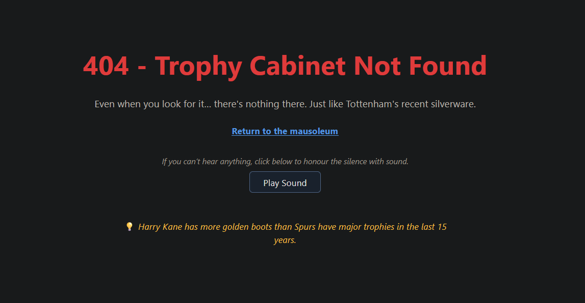

  

# The History of the Tottenham ⚪📉⚰️

A rigorously documented multimedia museum chronicling the long and storied tradition of nearly winning things. This interactive web application offers an exhaustive exploration of Tottenham Hotspur’s contribution to comedy, footballing folklore, and fourth-place finishes.

> “To dare is to bottle it in the semi-final.”
> – Tottenham Hotspur, 1882–Eternity

---

## 📚 Featured Exhibits

- ⏱️ **Trophy Drought Timer**  
  A live digital chronograph counting the years, days, hours, and seconds since Tottenham last touched a trophy in anger (2008, a time before TikTok, VAR, and some of their fans were even born).

- 🤡 **Statistical Banter Engine**  
  A button that delivers cold, hard numbers — each one a dagger of reality. Powered by data, sarcasm, and Spurs' inability to win when it matters.

- 💀 **The Collapse Archive™**  
  An interactive collection of famous faceplants, bottlings, and European exits — all lovingly linked to actual news reports for historical verification and viewer despair.

- 🎭 **Signings of the Season**  
  Explore a carousel of flops, frauds, and faded hopes. Each card lovingly designed in the style of Top Trumps — just without the "trump" part.

- 💿 **Spurs’ Greatest Moments: The DVD**  
  A rotating playlist of awkward highlights, calamity goals, and tragic commentary — all available in glorious 480p, just like the glory days.

- 🎺 **Auditory Grief Buttons**  
  Tap to experience sad trombones, violin loops, and a mysterious Australian man saying “who mate?” whenever the site updates.

- 🏆 **Trophy Cabinet Simulator (404)**  
  Explore the emptiest interactive experience on the web. Not found — much like their silverware since 1991.

---

## 🧪 Tech Stack (more reliable than Spurs' back four)

- **React + Vite** – Fast. Unlike Tottenham.
- **Firebase** – For storing your jokes and disappointment in the cloud.
- **Custom CSS** – Because unlike Spurs, we finish what we start.
- **Vercel** – Deploying updates faster than Daniel Levy bins managers.
- **GitHub** – Version-controlled, unlike Tottenham's midfield.

---

## 🌍 Live Website

Wallow with us at:  
**[https://thehistoryofthetottenham.com](https://thehistoryofthetottenham.com)**  
(Optimised for mobile, tablets, and Spursy-sized screens)

---

## 📈 Feature Roadmap (subject to collapse under pressure)

- 🧠 **Postecoglou’s Set Piece Memory Game**  
  Try to recall any corner Tottenham defended properly this season. Impossible mode: Europa Conference League away.

- 🧀 **The Interactive Cheese Room Experience™**  
  Click to wander through a luxury suite that definitely exists. Honest.

- 🧮 **Cost-per-Trophy Calculator**  
  Enter stadium cost, ticket prices, and shirt sales. Output = depression.

- 🧥 **Kit Regret Simulator**  
  See your new signing fail in real time. Refund not available.

- 🎮 **Levy Transfer Negotiation Simulator**  
  Experience the thrill of nearly buying someone for 8 straight weeks.

- 💻 **VR Trophy Tour**  
  Stand inside an empty cabinet. Echo included.

- 📢 **Delusion Generator 3000™**  
  Hit refresh to hear “This is our year!” in 1,000 dialects.

- 🕯️ **Harry Kane Eternal Flame**  
  A candle that burns forever in the vague direction of Munich.

---

## 👨‍🏫 Curated By

Historical integrity and banter maintained by  
**[@teknotel17](https://github.com/teknotel17/the-history-of-the-tottenham)**

---

## 🧾 Legal + AdSense Readiness

- Privacy Policy, Terms of Use, and broken dreams included.
- Fully compliant, SEO-ready, and extremely sarcastic.
- Contact: **info@thehistoryofthetottenham.com**

---

## ⚠️ Disclaimers

All images of trophies are for illustrative purposes only.  
No Spurs fans were harmed in the making of this site — emotionally, anyway.  
This project is a satire. Which is just another way of saying "Tottenham."

---

> “The History of the Tottenham isn’t written in silver — it’s written in tears, tweets, and DVDs.”
